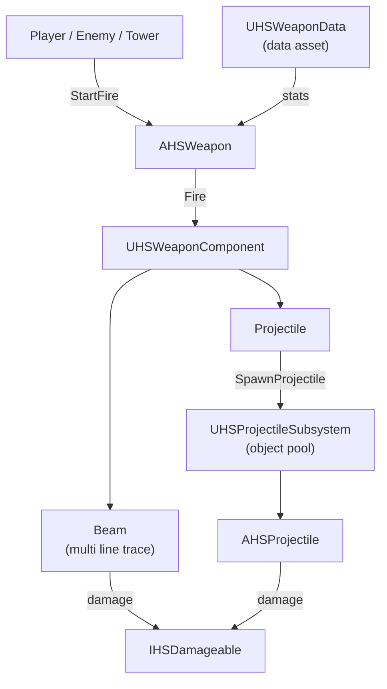

# Hoard Survivor

A first-person survival game built in **C++ and Unreal Engine 5.7**.
My main portfolio project for the **Game Programming** course at **CG Spectrum**.

## About

Hordes of enemies are after the monument you're trying to extract. Hold them off with melee, ranged weapons, or towers and turrets, and build up your base as the waves grow.

## Features

- **Fight your way:** melee, ranged weapons, or towers and turrets
- **Build:** towers, upgrade stations, shops, and resource-generating buildings
- **Progress between runs:** earn resource points every run and spend them in a talent tree to unlock/empower your weapons and buildings!

## Technical Highlights

- **Data driven weapons:** every weapon is a Primary Data Asset (damage, fire rate, range, magazine size, reload time, fire mode). New weapons need no new code.
- **Composition over inheritance:** one `AHSWeapon` actor plus a swappable fire type component (beam or projectile), chosen by the data asset at runtime. The player, enemies, and towers all use the same weapon class.
- **Projectile pooling:** a World Subsystem reuses projectiles per class instead of spawning and destroying them, built to handle hundreds of projectiles per second.
- **Interface based system:** anything that implements `IHSDamageable` can be hit, so weapons never depend on specific enemy classes.
- **Custom collision channels:** projectiles pierce enemies and stop at walls using custom collision channels. Projectiles lose 35% damage for each enemy they pass through.
  
### Weapon System

## Author

**Farzad Rayan**

[LinkedIn](https://www.linkedin.com/in/farzad-rayan/) · [Email](mailto:farzad.128.black@gmail.com)
